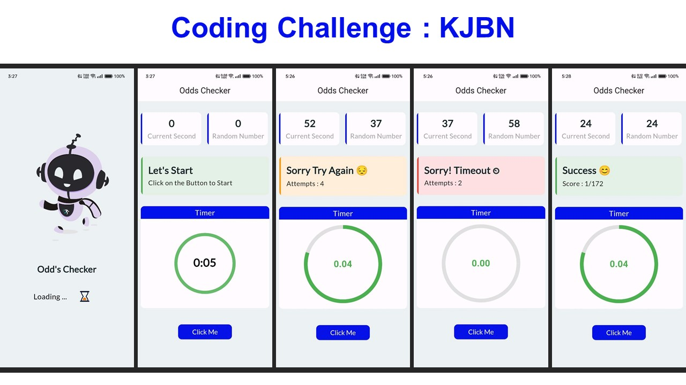

# Coding Challenge KJBN

A Flutter app to determine if the seconds count after a button is pressed matches a randomly generated number, and to display an appropriate message.

## Getting Started

Just press Click me continue pressing untill you get a success message

### Screenshots

## Developer Details

**Name:** Md Imran Hussain

- **Portfolio Website:** [lykanimran.github.io](https://lykanimran.github.io/)
- **LinkedIn:** [Imran Hsnx](https://www.linkedin.com/in/imran-hsnx/)
- **GitHub:** [LykanImran](https://github.com/LykanImran)
- **Twitter:** [imranhussainx](https://twitter.com/imranhussainx)

